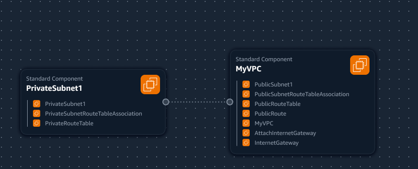
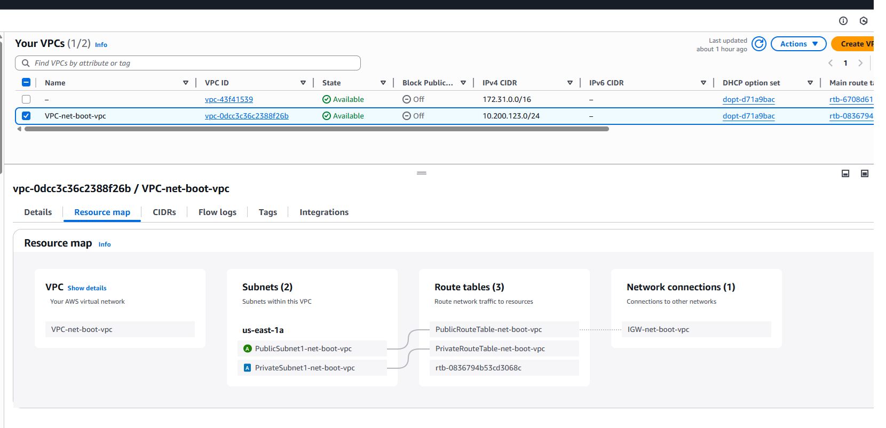
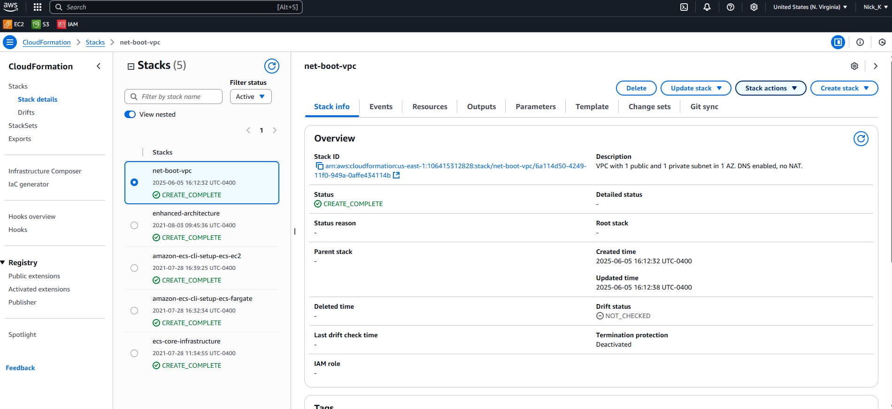

## VPC Settings

These are the VPC settings we observed Time setup for our cloud environment in AWS
- VPC IPv4 CIDR Block: 10.200.123.0/24
- IPv6 CIDR: no
- Number of AZs: 1
- Number of PVT Subnets: 1
- Number of NAT: 0
- VPC Endpoints: 0
- DNS Options: Enable DNS Hostnames
- DNS Options: Enable DNS Resolution

## Generated and Review CFN Template

Watching the instructors videos, I noted the VPC Settings, provided this to LLM to produce the CFN template to automate the provision of the VPC infrastructure.

I reviewed the CFN template and asked the LLM to refactored it to utilize parameters instead of hard coding values and the template is more reusable.

## Generated Deploy Script
Using ChatGPT generated a bash script in `bin/deploy`.

I had it change the the shebang to be OS agnostic

## Visualization in Infrastructure Composer

I thought maybe we could visulaize our VPC via AWS Infra Composer, but it's not the best representation.

## Verified installation of AWS CLI

Documentation link for installation: https://docs.aws.amazon.com/cli/latest/userguide/getting-started-install.html

Verified installation with `aws sts get-caller-identity` which can be found at: https://docs.aws.amazon.com/cli/latest/reference/sts/get-caller-identity.html

## Deployed Resource to AWS

Added resource map of VPC deployed with CFN.

