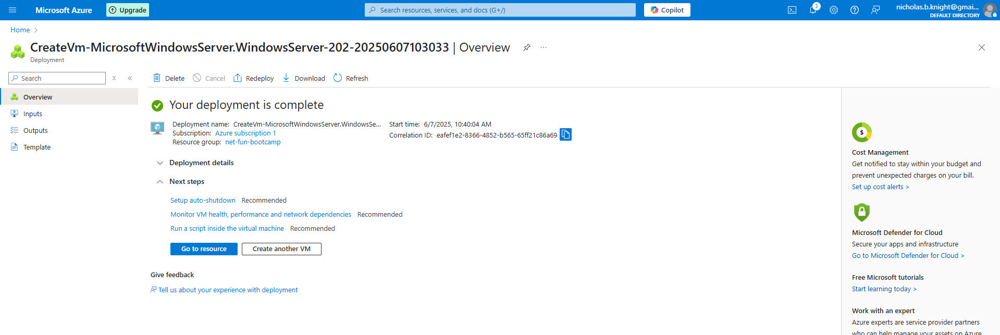

## Downloaded Azure Resource Template

After deploying my Microsoft Windows Server 2025 to Azure VM.
I downloaded the Resource Templates to be able to easily deploy again.

## Verified Successful Deployment of Azure VM

After downloading the template I verified the deployment of the Azure VM.


## Converting Resource Template to Azure Bicep

Following the video, I am going to convert the Windows Template and convert to Azure Bicep.

Install and Login to Azure CLI
```sh
curl -sL https://aka.ms/InstallAzureCLIDeb | sudo bash
az login --use-device-code
```
Was redirected to the provided link for authentication
```sh
https://login.microsoftonline.com/organizations/oauth2/v2.0/authorize?client_id=04b07795-8ddb-461a-bbee-02f9e1bf7b46&response_type=code&redirect_uri=http%3A%2F%2Flocalhost%3A37641&scope=https%3A%2F%2Fmanagement.core.windows.net%2F%2F.default+offline_access+openid+profile&state=URtyEIMQsNjlFAHx&code_challenge=q68TX3-ES0IX2oaXWMMo7Ys-r7mwGxaVl46gK2oDjAc&code_challenge_method=S256&nonce=84f2198ef377a63bb3c46c16bd043dcb1b54a40516bdc85e3f7349383ecc60ef&client_info=1&claims=%7B%22access_token%22%3A+%7B%22xms_cc%22%3A+%7B%22values%22%3A+%5B%22CP1%22%5D%7D%7D%7D&prompt=select_account
```

Convert to Azure Bicep

```sh
az bicep decompile --file <path-to-template.json>
```

After decompiling, we noticed that the bicep file was still pretty verbose.
It turns out that the decompile with makes the output 1:1 to json.
We asked ChatGPT to slim it down and clean it up to reduce the # of lines.

## Deploy Bicep File

```sh
az deployment group create \
  --resource-group myResourceGroup \
  --template-file ./yourtemplate.bicep \
  --parameters @parameters.json
```

## Switching Regions from USEAST2 to USEAST
