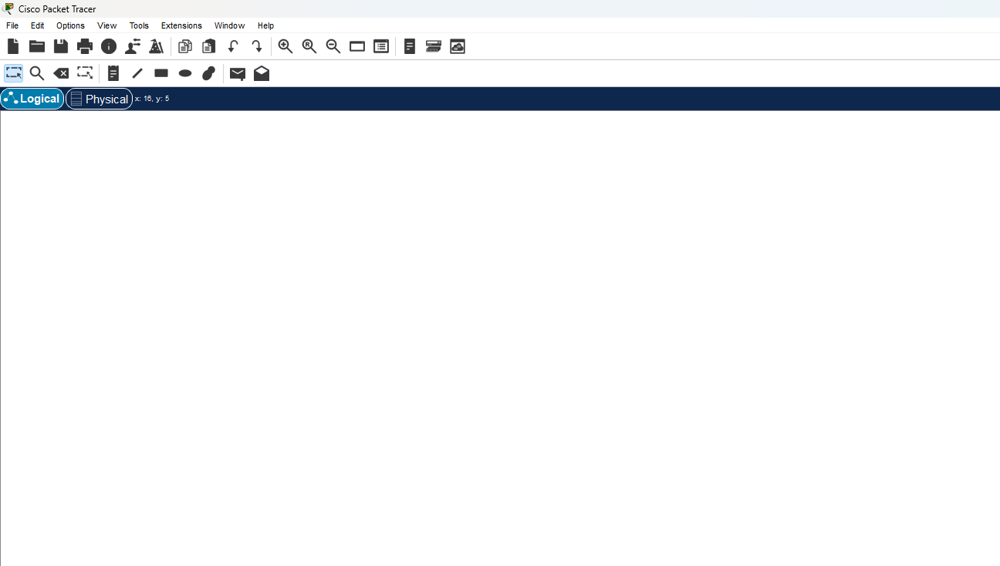
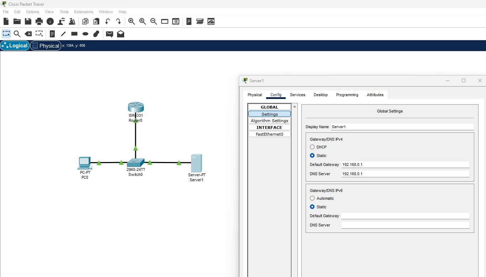
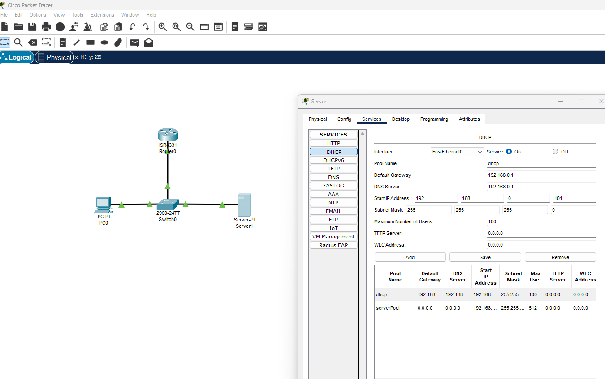

# Packet Tracer Lab

## Download and Install Packet Tracer

Download installer from [Cisco Networking Academy](https://www.bing.com/ck/a?!&&p=c3af7d46554d0c99981569c1e40798ecb8ecea640d39e574ba2e3b2c4627ff38JmltdHM9MTc0OTI1NDQwMA&ptn=3&ver=2&hsh=4&fclid=01621e3e-e315-6f18-29c0-0a6ae2026e91&psq=download+cisco+packet+tracer&u=a1aHR0cHM6Ly93d3cubmV0YWNhZC5jb20vY2lzY28tcGFja2V0LXRyYWNlcg&ntb=1)

- Create and account or log in
- Download and install
- Launch menu will give you two (2) options; Network Academy and Skills for all. I couldn't get the first option to load so I chose [Skills for All](https://community.cisco.com/t5/online-tools-and-resources/can-not-login-to-packet-tracer-after-maintenance-27th-august/td-p/5166223)



## Create Network

- On Packet Tracer, network will consist of:
1. 1 Router
2. 1 Switch
3. 1 PC
4. 1 DHCP Server

- Choose ethernet cable (copper straight through)
1. Select PC
    - Only option is FastEthernet0
2. Connect to Switch
     - FastEthernet0/1
3. Connect Router to Switch
     - Router: GigabitEthernet0/0/0 to Switch: GigabitEthernet0/1
4. Connect Switch and DHCP Server
     - Switch: FastEthernet0/24 to DHCP Server: FastEthernet0

- Configure Router
1. Select Router
2. Select CLI
3. ```sh
    Router>en
    Router#conf t
    Router (config) #int gi0/0/0
    Router (config-if) #ip address 192.168.0.1 255.255.255.0 // IP Address and Subnet mask
    Router (config-if) #no shut // Turn on interface
   ```
- Configure DHCP
1. Choose Config > Global Settings
   - GatewayDNS IPv4 > ***Assign static IP. Default Gateway is the router***
  ```sh
  Default Gateway: 192.168.0.1
  DNS Server: 192.168.0.1
  ```
2. Choose Config > FastEthernet0
   - IP Configuration
  ```sh
  IPv4 Address: 192.168.0.100
  Subnet Mask: 255.255.255.0
  ```


3. Turn on Services
  - Need to tell others the default gateway as well as IP address
  ```sh
  Default Gateway: 192.168.0.1
  DNS Server: 192.168.0.1
  Start IP Address: 192.168.0.101 //Start after DHCP server
  Subnet Mask: 255.255.255.0
  Maximum Number of Users: 100
  ```
4. Save
5. Open Simulation Mode
6. turn Service on


