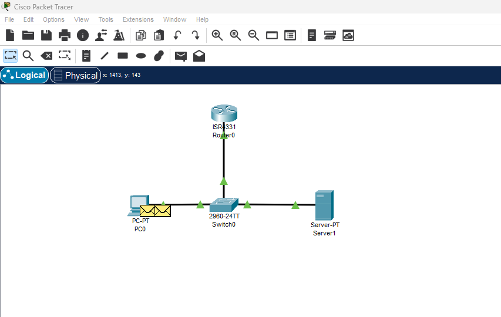

# Packet Tracer Lab

## State of the Network

- On Packet Tracer, network will consist of:
1. 1 Router
2. 1 Switch
3. 1 PC
4. 1 DHCP Server

- Configure Router
1. Select Router
2. Select CLI
3. Configure DHCP
4. Configure IP

### Description:
- PC sends a broadcast packet to the switch.
- Because it's a broadcast packet, it will leave the switch and go to both the DHCP server and the Router.
- Only the DHCP server will send a response because it is listening on port 67 and the router is not
- Sends a Gratuitous ARP for 192.168.0.1, but it fails
- DHCP server sends back an "offer" to the PC, via the switch.
- The PC agrees to the offer (.102) back to the DHCP
- The DHCP server then sends back a message that the IP has been assigned to the PC.
- The PC now sends out a gratuitous ARP to alert of it's new IP.

