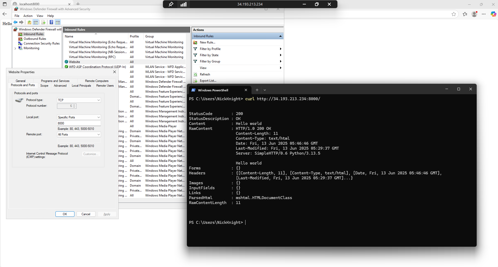

## Firewall Rules Testing Locally

When attemptin to test Firewall rules locally, we determine that it's hard to test when you are using localhost because Firewall rules will not block on the same network so we need to attempt to access the network on a different machine.

## AWS Windows Server, Service simple website

We were able to start a web server using python to serve a single static page. 

The fiewall rules block everything that does not have an inbound rule.

We added an inbound rule for port 8000, from our local machine, we used CURL and were able to see the server.

We also had to remember to open port 8000 on our AWS Security group.
