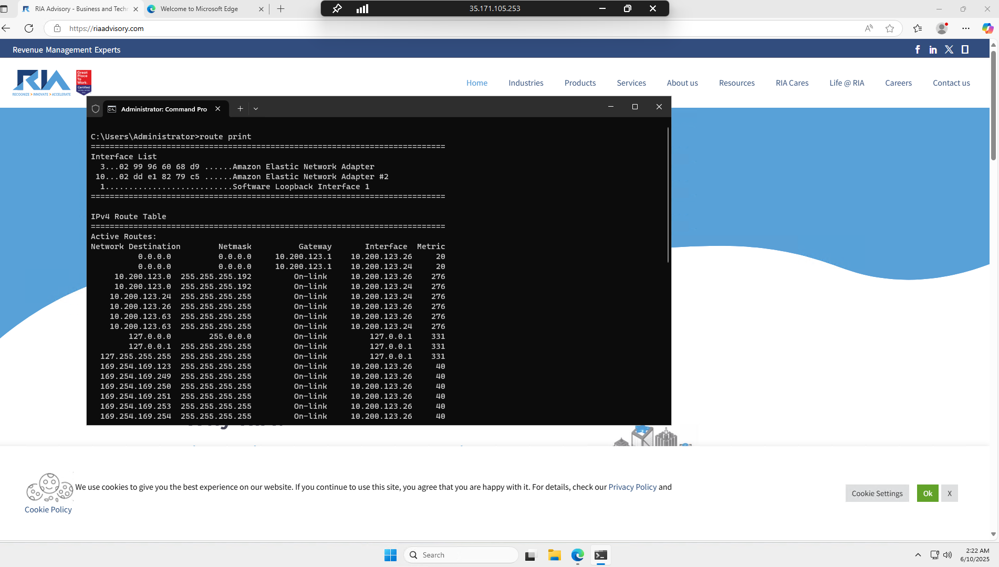
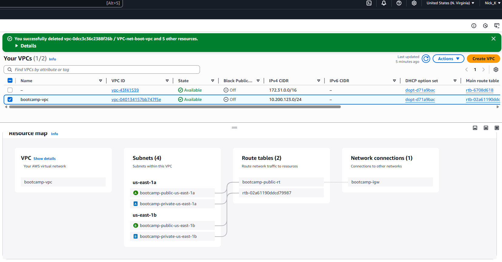
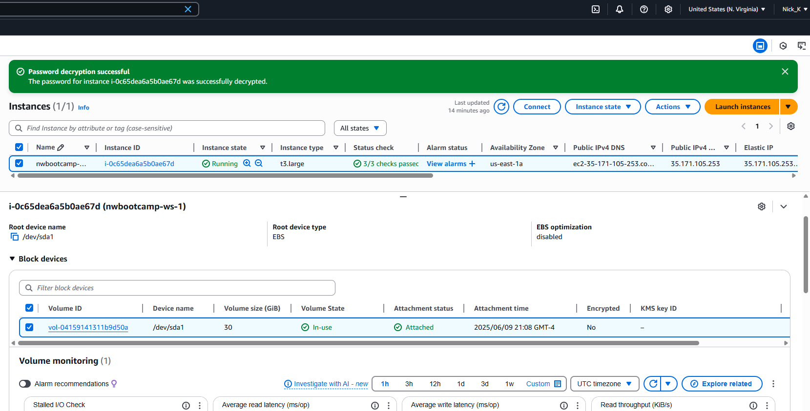

## Developer Environment

<Screenshot proof of work of cloud environment.>


<Describe your cloud environment>
My setup is a Windows Server 2025 that is deployed on an EC2 in AWS. I have the standard setup that Tim gave us,
on the first episode, but I added a second AZ and subnet. 



The EC2 instance has an elastic IP and a security group attached to it.
30 GB of storage is available and the size is a t3.large. It is deployed
in the us-east-1a AZ. 




## IPConfig

```ps
C:\Users\Administrator>ipconfig

Windows IP Configuration


Ethernet adapter Ethernet:

   Connection-specific DNS Suffix  . : ec2.internal
   Link-local IPv6 Address . . . . . : fe80::13e3:1556:4f3a:a6e7%3
   IPv4 Address. . . . . . . . . . . : 10.200.123.26
   Subnet Mask . . . . . . . . . . . : 255.255.255.192
   Default Gateway . . . . . . . . . : 10.200.123.1

Ethernet adapter Ethernet 2:

   Connection-specific DNS Suffix  . : ec2.internal
   Link-local IPv6 Address . . . . . : fe80::95a1:a4c8:b95:628b%10
   IPv4 Address. . . . . . . . . . . : 10.200.123.24
   Subnet Mask . . . . . . . . . . . : 255.255.255.192
   Default Gateway . . . . . . . . . : 10.200.123.1
```

Provides a list of adapters, IP addresses, subnet masks. Gives us the basic configuration of the network stack.

## Ping 

```ps
C:\Users\Administrator>ping google.com

Pinging google.com [142.250.31.100] with 32 bytes of data:
Reply from 142.250.31.100: bytes=32 time=1ms TTL=101
Reply from 142.250.31.100: bytes=32 time=1ms TTL=101
Reply from 142.250.31.100: bytes=32 time=1ms TTL=101

Ping statistics for 142.250.31.100:
    Packets: Sent = 3, Received = 3, Lost = 0 (0% loss),
Approximate round trip times in milli-seconds:
    Minimum = 1ms, Maximum = 1ms, Average = 1ms
```
Ping sends a request to a device and waits for a reply, to check if it's reachable and how long the round trip took. In the example we are pinging Google.com and it is taking 1ms for the round trip.

## Trace Route

```ps
C:\Users\Administrator>tracert www.riaadvisory.com

Tracing route to riaadvisory.com [204.11.58.150]
over a maximum of 30 hops:

  1     1 ms    13 ms     1 ms  100.100.32.122
  2     1 ms     3 ms     1 ms  100.100.32.121
  3     1 ms     1 ms     1 ms  100.100.80.224
  4    57 ms   120 ms     3 ms  100.100.80.195
  5     1 ms     1 ms     1 ms  100.100.2.120
  6     1 ms     1 ms     1 ms  ae-10.a05.asbnva02.us.bb.gin.ntt.net [128.242.180.121]
  7     1 ms     1 ms     1 ms  ae-1.r27.asbnva02.us.bb.gin.ntt.net [129.250.5.6]
  8    62 ms    62 ms    62 ms  ae-5.r27.lsanca07.us.bb.gin.ntt.net [129.250.5.2]
  9    62 ms    62 ms    62 ms  ae-17.a04.lsanca07.us.bb.gin.ntt.net [129.250.3.243]
 10    66 ms    62 ms    63 ms  ce-1-1-2.a04.lsanca07.us.ce.gin.ntt.net [128.241.10.27]
 11    62 ms    62 ms    62 ms  162-215-195-163.unifiedlayer.com [162.215.195.163]
 12    65 ms    64 ms    64 ms  162-215-193-229.unifiedlayer.com [162.215.193.229]
 13    65 ms    69 ms    64 ms  69-195-64-233.unifiedlayer.com [69.195.64.233]
 14    64 ms    64 ms    64 ms  69-195-64-103.unifiedlayer.com [69.195.64.103]
 15    64 ms    64 ms    64 ms  162-144-240-175.unifiedlayer.com [162.144.240.175]
 16    57 ms    62 ms    57 ms  204-11-58-150.unifiedlayer.com [204.11.58.150]

Trace complete.
```
Sends a ping with a ttl of 1, records every hop, and the finds the path and the performance of that pat
between your machine and the end device. The example above shows the path from my EC2 to www.riaadvisory.com. 

## Netstat

```ps
C:\Users\Administrator>netstat

Active Connections

  Proto  Local Address          Foreign Address        State
  TCP    10.200.123.26:3389     75-57-112-124:58415    ESTABLISHED
  TCP    10.200.123.26:49809    104.208.203.90:https   ESTABLISHED
  TCP    10.200.123.26:53992    104.208.203.90:https   ESTABLISHED

C:\Users\Administrator>netstat

Active Connections

  Proto  Local Address          Foreign Address        State
  TCP    10.200.123.26:3389     75-57-112-124:58415    ESTABLISHED
  TCP    10.200.123.26:49809    104.208.203.90:https   ESTABLISHED
  TCP    10.200.123.26:53992    104.208.203.90:https   ESTABLISHED
  TCP    10.200.123.26:64130    150.171.27.11:http     TIME_WAIT
  TCP    10.200.123.26:64131    13.107.42.16:https     TIME_WAIT
  TCP    10.200.123.26:64132    150.171.28.11:https    TIME_WAIT
  TCP    10.200.123.26:64133    bk-in-f100:https       TIME_WAIT
  TCP    10.200.123.26:64134    a-0003:https           TIME_WAIT
  TCP    10.200.123.26:64136    ww-in-f132:https       TIME_WAIT
  TCP    10.200.123.26:64138    13.107.42.16:https     TIME_WAIT
  TCP    10.200.123.26:64139    150.171.28.11:https    TIME_WAIT
  TCP    10.200.123.26:64140    13.91.96.185:https     TIME_WAIT
  TCP    10.200.123.26:64141    20.190.151.7:https     ESTABLISHED
  TCP    10.200.123.26:64142    13.107.42.16:https     TIME_WAIT
  TCP    10.200.123.26:64143    20.190.151.7:https     ESTABLISHED
  TCP    10.200.123.26:64144    a23-13-145-132:http    ESTABLISHED
  TCP    10.200.123.26:64145    a23-13-145-132:http    ESTABLISHED
  TCP    10.200.123.26:64146    20.25.227.174:https    ESTABLISHED
  TCP    10.200.123.26:64148    a-0003:https           ESTABLISHED
  TCP    10.200.123.26:64149    a23-54-127-5:https     ESTABLISHED
  TCP    10.200.123.26:64150    150.171.27.10:https    ESTABLISHED
  TCP    10.200.123.26:64152    20.110.205.119:https   ESTABLISHED
  TCP    10.200.123.26:64153    150.171.27.12:https    ESTABLISHED
  TCP    10.200.123.26:64155    server-3-167-69-86:https  ESTABLISHED
  TCP    10.200.123.26:64157    a23-48-203-115:https   ESTABLISHED
  TCP    10.200.123.26:64158    150.171.28.11:https    ESTABLISHED
  TCP    10.200.123.26:64160    13.107.246.40:https    ESTABLISHED
  TCP    10.200.123.26:64161    150.171.27.11:https    ESTABLISHED
  TCP    10.200.123.26:64162    150.171.27.11:https    ESTABLISHED
  TCP    10.200.123.26:64163    bj-in-f95:https        ESTABLISHED
  TCP    10.200.123.26:64164    a23-209-57-216:https   ESTABLISHED
  TCP    10.200.123.26:64165    a23-209-57-216:https   CLOSE_WAIT
  TCP    10.200.123.26:64166    13.91.96.185:https     ESTABLISHED
  TCP    10.200.123.26:64169    104.208.16.89:https    ESTABLISHED
  TCP    10.200.123.26:64170    a23-50-125-163:https   ESTABLISHED
  TCP    10.200.123.26:64171    13.107.246.40:https    ESTABLISHED
  TCP    10.200.123.26:64173    13.107.246.40:https    ESTABLISHED
  TCP    10.200.123.26:64175    13.107.246.40:https    ESTABLISHED
  TCP    10.200.123.26:64176    13.107.246.40:https    ESTABLISHED
  TCP    10.200.123.26:64177    13.107.246.40:https    ESTABLISHED
  TCP    10.200.123.26:64178    13.107.246.40:https    ESTABLISHED
  TCP    10.200.123.26:64179    13.107.246.40:https    ESTABLISHED
  TCP    10.200.123.26:64180    a-0003:https           ESTABLISHED
  TCP    10.200.123.26:64181    a23-53-11-237:https    ESTABLISHED
  TCP    10.200.123.26:64183    104.16.175.226:https   ESTABLISHED
  TCP    10.200.123.26:64184    13.107.246.40:https    ESTABLISHED
  TCP    10.200.123.26:64185    204-11-58-150:http     CLOSE_WAIT
  TCP    10.200.123.26:64186    204-11-58-150:http     ESTABLISHED
  TCP    10.200.123.26:64188    4.153.129.168:https    ESTABLISHED
  TCP    10.200.123.26:64189    13.107.246.40:https    ESTABLISHED
  TCP    10.200.123.26:64190    a23-50-125-135:https   ESTABLISHED
  TCP    10.200.123.26:64191    a23-220-124-10:https   ESTABLISHED
  TCP    10.200.123.26:64192    a23-220-124-10:https   ESTABLISHED
  TCP    10.200.123.26:64193    104.208.16.89:https    ESTABLISHED
  TCP    10.200.123.26:64194    104.208.16.89:https    ESTABLISHED
  TCP    10.200.123.26:64197    pd-in-f95:https        ESTABLISHED
  TCP    10.200.123.26:64199    wv-in-f97:https        ESTABLISHED
  TCP    10.200.123.26:64200    192.0.76.3:https       ESTABLISHED
  TCP    10.200.123.26:64201    ww-in-f100:https       ESTABLISHED
  TCP    10.200.123.26:64202    150.171.28.11:https    ESTABLISHED
```

Shows active connections of your computer. The example above show the active connections before opening a browser, and going to www.riaadvisory.com, and then active connections after.

## Route

```ps
C:\Users\Administrator>route print
===========================================================================
Interface List
  3...02 99 96 60 68 d9 ......Amazon Elastic Network Adapter
 10...02 dd e1 82 79 c5 ......Amazon Elastic Network Adapter #2
  1...........................Software Loopback Interface 1
===========================================================================

IPv4 Route Table
===========================================================================
Active Routes:
Network Destination        Netmask          Gateway       Interface  Metric
          0.0.0.0          0.0.0.0     10.200.123.1    10.200.123.26     20
          0.0.0.0          0.0.0.0     10.200.123.1    10.200.123.24     20
     10.200.123.0  255.255.255.192         On-link     10.200.123.26    276
     10.200.123.0  255.255.255.192         On-link     10.200.123.24    276
    10.200.123.24  255.255.255.255         On-link     10.200.123.24    276
    10.200.123.26  255.255.255.255         On-link     10.200.123.26    276
    10.200.123.63  255.255.255.255         On-link     10.200.123.26    276
    10.200.123.63  255.255.255.255         On-link     10.200.123.24    276
        127.0.0.0        255.0.0.0         On-link         127.0.0.1    331
        127.0.0.1  255.255.255.255         On-link         127.0.0.1    331
  127.255.255.255  255.255.255.255         On-link         127.0.0.1    331
  169.254.169.123  255.255.255.255         On-link     10.200.123.26     40
  169.254.169.249  255.255.255.255         On-link     10.200.123.26     40
  169.254.169.250  255.255.255.255         On-link     10.200.123.26     40
  169.254.169.251  255.255.255.255         On-link     10.200.123.26     40
  169.254.169.253  255.255.255.255         On-link     10.200.123.26     40
  169.254.169.254  255.255.255.255         On-link     10.200.123.26     40
        224.0.0.0        240.0.0.0         On-link         127.0.0.1    331
        224.0.0.0        240.0.0.0         On-link     10.200.123.26    276
        224.0.0.0        240.0.0.0         On-link     10.200.123.24    276
  255.255.255.255  255.255.255.255         On-link         127.0.0.1    331
  255.255.255.255  255.255.255.255         On-link     10.200.123.26    276
  255.255.255.255  255.255.255.255         On-link     10.200.123.24    276
===========================================================================
Persistent Routes:
  None

IPv6 Route Table
===========================================================================
Active Routes:
 If Metric Network Destination      Gateway
  1    331 ::1/128                  On-link
  3     40 fd00:ec2::123/128        On-link
  3     40 fd00:ec2::250/128        On-link
  3     40 fd00:ec2::253/128        On-link
  3     40 fd00:ec2::254/128        On-link
  3    276 fe80::/64                On-link
 10    276 fe80::/64                On-link
  3    276 fe80::13e3:1556:4f3a:a6e7/128
                                    On-link
 10    276 fe80::95a1:a4c8:b95:628b/128
                                    On-link
  1    331 ff00::/8                 On-link
  3    276 ff00::/8                 On-link
 10    276 ff00::/8                 On-link
===========================================================================
Persistent Routes:
  None
```

Route allows you to look at the route table of your Windows box, route print will show you the routes, and you could also edit your route table.